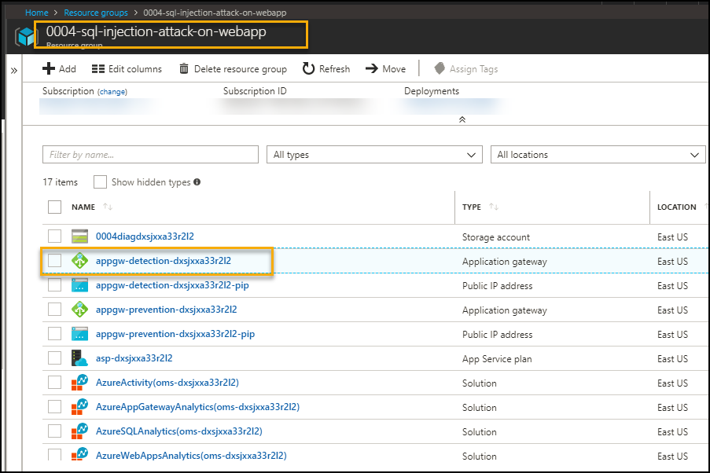
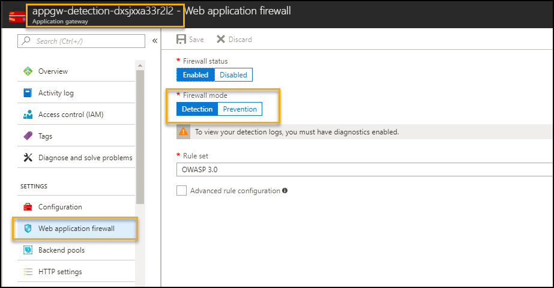
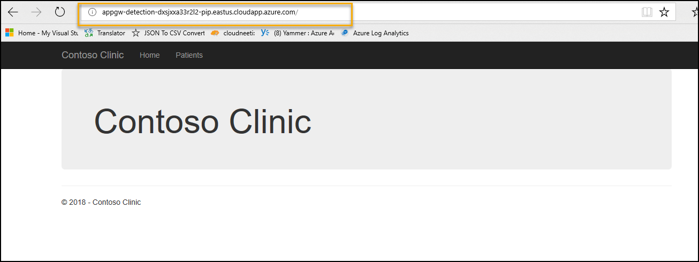
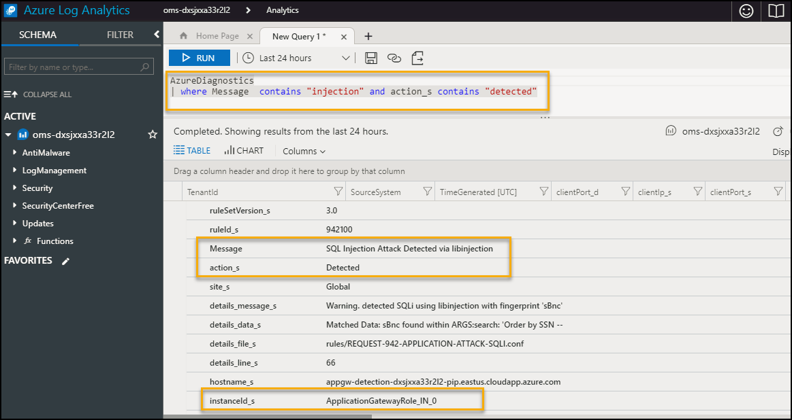
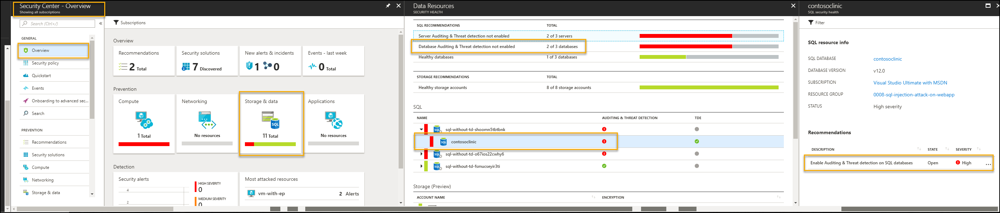
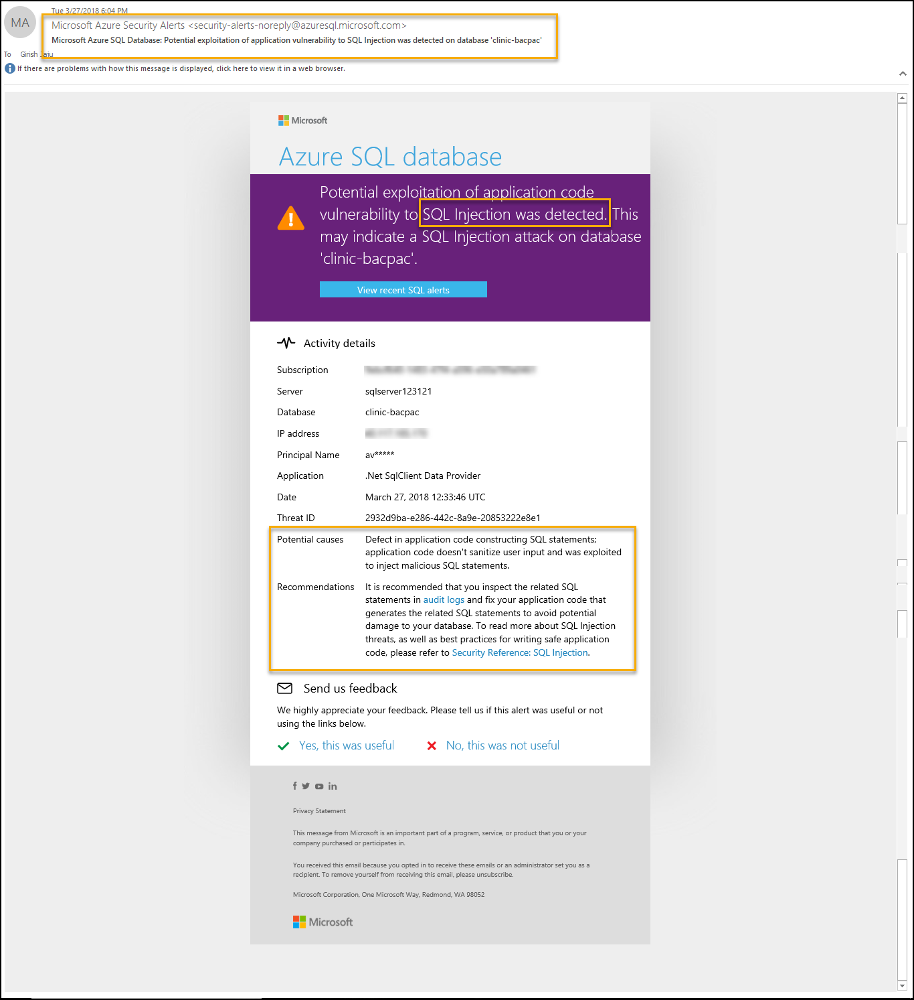
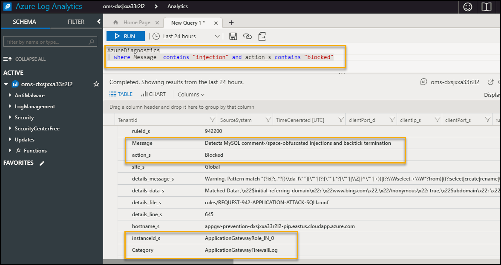

# SQL injection attack on a Web Application Scenario 

<a href="https://portal.azure.com/#create/Microsoft.Template/uri/https%3A%2F%2Fraw.githubusercontent.com%2Fshs110%2FWebApp-with-App-Gateway%2Fmaster%2Fazuredeploy.json" target="_blank">
     
</a>
<a href="http://armviz.io/#/?load=https%3A%2F%2Fraw.githubusercontent.com%2Fshs110%2FWebApp-with-App-Gateway%2Fmaster%2Fazuredeploy.json" target="_blank">
     
</a>

# Table of Contents
1. [Objectives](#objectives)
2. [Design Decision](#designdecision)
3. [Suggested Improvements](#suggestedimprovements)
4. [Overview](#overview)
5. [Pre-requisites](#prerequisites)
6. [Perform Attack](#attack)
7. [Detect Attack](#detect)
8. [Respond/Mitigate](#mitigate)
9. [Teardown Deployment](#teardown)

     

<a name="objectives"></a>
# Objective of the POC 
This project deploys the following Azure resources:

* Application gateway (WAF enabled)
* Application gateway (WAF disabled)
* App service plan
* App Service (Web App)
* Application Insights
* SQL Server
* SQL Database 
* Log Analytics Workspace

Simply click on the *Deploy to Azure* button and log into your Azure subscription to deploy the solution.

This playbook also demonstrates an SQL injection attack against an unprotected sample web application.  After simulating an attack, harden the resources by applying protections to the web and SQL layers.  Re-attempt the attack against the protected application to see the defense in action.

<a name="designdecision"></a>
# Design Decision

Given the time constraints, I designed the architecture for a basic web application that fetches patient data stored in a database. I added a few components that reflects best cloud design principles but a lot more components could definitely be added for higher scalibility and availibility(see next section):

* Application Gateway: A layer 7 web traffic load balancer that enables you to manage traffic to your web applications. With Application Gateway, you can make routing decisions based on additional attributes of an HTTP request, such as URI path or host headers.

* App service plan/App services: A quick and easy PAAS offering to host your website. I automated deployment of the site in the ARM template by referring to the packaged zip solution file under artifacts

* Application Insights/Log Analytics Workspace: App Insights can effectively monitor the health and performance of your application as well as troubleshoot potential failures. Log analytics is automatically connected to the App service, database and App gateway to log and query traffic. In this case, we will run a query to detect SQL injection attacks  

<a name="suggestedimprovements"></a>
# Suggested Improvements

Given more time, I would have added the following components for higher scalibility and availibility:

**Traffic Manager: The architecture can use a primary and secondary region to achieve higher availability. The application is deployed to each region. During normal operations, network traffic is routed to the primary region. If the primary region becomes unavailable, traffic is routed to the secondary region.**

**Cache: Store semi-static data in Azure Cache for Redis.**

**CDN: Use Azure Content Delivery Network (CDN) to cache publicly available content for lower latency and faster delivery of content.**

**Queue: The application can queue background tasks by putting a message onto an Azure Queue storage queue. The message triggers a function app. Alternatively, you can use Service Bus queues.** 

**Function App. Use Function Apps to run background tasks. Functions are invoked by a trigger, such as a timer event or a message being placed on queue. For long-running stateful tasks, use Durable Functions.**

<a name="overview"></a>
# SQL Attack Overview
This document showcases following use cases
1. Perform SQL injection attack on Web App with following configuration --> Application detects attack using application gateway
    * Application Gateway (WAF enabled-Detection mode)
    * SQL DB with Threat Detection disabled

2. Perform SQL injection attack on Web App with following configuration --> Application detects attack using application gateway and SQL database alert
    * Application Gateway (WAF enabled-Detection mode)
    * SQL DB with Threat Detection enabled and Send
 Alert To selected

3. Perform SQL injection attack on Web App with following configuration --> Application prevents attack
    * Application Gateway (WAF enabled-Prevention mode)
    * SQL DB with Threat Detection enabled and Send Alert To selected


# Important Notes <a name="notes"></a>
Although the deployment takes 20-25mins, the log aggregation by OMS take a few hours to get configured in the backend. You may not see attack/mitigation logs for detection and prevention events during the aggregation time window.   
Subsequently logs will take 10-15 mins to reflect in OMS.


<a name="prerequisites"></a>
# Prerequisites
Access to Azure subscription to deploy following resources 
1. Application gateway (WAF enabled)
2. App Service (Web App)
3. SQL Database 
4. Log Analytics Workspace

<a name="attack"></a>
# Perform Attack 
Attack on web app with
* Application gateway - WAF - Detection mode 
* SQL server and database with Threat Detection disabled. 

1. Go to Azure Portal --> Select Resource Groups services --> Select Resource Group --> <ResourceGroupName> given during deployment

2. Select Application Gateway with name 'appgw-detection-' as prefix.

    

3. Application Gateway WAF enabled and Firewall in Detection mode as shown below.

    

4. On Overview Page --> Copy Frontend public IP address (DNS label) as
    

5. Open Internet Explorer with above details as shown below  
    

6. Click on Patient link it will display list of details 

    

7. Perform SQL Injection attack by copying " **'order by SSN--** " in search box and click on "Search". Application will show sorted data based on SSN.

        
    
    
<a name="detect"></a>
# Detect  
###  Detection using OMS
To detect the attack, execute following query in Azure Log Analytics
<p/>
<u>Note</u>: first time it takes few hours for OMS to pull logs for detection and prevention events. For subsequent requests it takes 10-15 mins to reflect in OMS, so if you don't get any search results, please try again after sometime.
<p/>
1. Go to Azure Portal --> navigate to Log Analytics in same resource group 

 

2. Go to Log analytics --> Click on Log Search --> Type query search 

    ```AzureDiagnostics | where Message  contains "Injection" and action_s contains "detected"```

     
    
3. Following details gets logged 

     
    
 ###  Azure Security Center Recommendation
 
1. Azure Security Center gives  recommendations to enable Auditing and Threat Detection and allows you to perform  steps from the console itself.

 

2. Azure Portal > Security Center - Overview > Data Resources > contosoclinic > Enable Auditing & Threat detection on SQL databases >Auditing & Threat Detection 


## Monitor / Detect 

Once Auditing & Threat Detection is database is enabled for SQL database, Azure Security Center sends email alert mentioned in Send alert to field. Execute the step 7 to perform SQL Injection attack




<a name="mitigate"></a>
# Mitigate 

  * Update Web application firewall mode to Prevention for application gateway. This will take 5-10 mins. Hence, we will connect the application using Application Gateway (WAF- Prevention mode) 

        
    
  

## Detection after Mitigation
* Execute the step 4,5, 6 and 7 to perform SQL Injection attack with Application Gateway having WAF Enabled and Firewall in Prevention


      

 
* To detect the prevention of attack, execute following query in Azure Log Analytics


    ```AzureDiagnostics | where Message  contains "injection" and action_s contains "blocked"```
    
      


    You will notice events related to detection and prevention items. First time it takes few hours for OMS to pull logs for detection and prevention events. For subsequent requests it takes 10-15 mins to reflect in OMS, so if you don't get any search results, please try again after sometime.
    


<a name="teardown"></a>
## Teardown Deployment 

Run following command to clear all the resources deployed during the demo. Specify resource group name given during deployment
 
 `Remove-AzureRmResourceGroup -Name <ResourceGroupName>  -Force `
 
    
Verification steps -
1. Login to Azure Portal / Subscription
2. Check if resource group name given during deployment is cleared.
<p/>

**References** 

https://docs.microsoft.com/en-us/azure/application-gateway/application-gateway-introduction
 
https://docs.microsoft.com/en-us/azure/application-gateway/application-gateway-web-application-firewall-overview
 
https://docs.microsoft.com/en-us/azure/sql-database/


